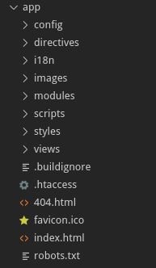
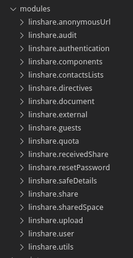
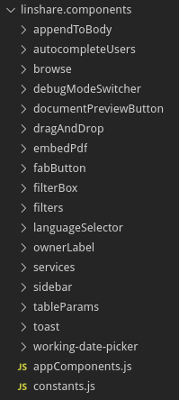

# LinShare UI User application layout

This documents gives an overview of the layout, and files organization, of linshare-ui-user application.

## root layout

The LinShare application frontend layout follows a classical AngularJS layout.

At the root of the application, files are mostly here to define dependencies and tasks handled through scripts.

Notable files are:

| File  | Purpose  |
|---------|-----------------|
| bower.json  | Define dependencies (frontend side). It’s using the Bower.io repository.  |
| package.json  | Define dependencies (tooling side). things like linters, job launchers, for the developer needs  |
|  Gruntfile.js | List of tasks used by developers to develop and build the app  |

The main part of the Linshare application is located under the app folder.

## app folder

Here is a detailled explanation of every folder:

| Folder name  | Purpose  |
|--------------|-----------------|
| config  | contains default configuration of the application. Here a vendor can override some settings, like adding/removing a translation, configuring SSO redirection urls...  |
| directives | The AngularJS generic directives of the application. |
| i18n | Translation files. LinShare currently supports en, fr, ru and vi. |
| images | Image files, used though the application. |
| modules | This is the big part of the application. LinShare features are grouped into modules. We’ll explore one module later in this document |
| scripts | Global code files, used for the application structure, or by modules. Most notable files here are app.js, which is the entry point of the app, route.js, defining the frontend routes. |
| styles | contains the CSS styles, using the SCSS format. |
| views | Global template files (views) of the application, in HTML. |

## LinShare frontend modules

As said earlier, the LinShare frontend application is organized around modules. Each module is contained into a folder.

Inside a module, developers tried as much as possible to stick to this organization:

* **modulenameModule.js**: This is the entry point of the module. It declares the AngularJS module and its dependencies.
* **constants.js**: when the module declares constants, those are put in this file.
* **route.js**: if the module needs to add frontend routes, this file will be present.
* **controllers**: the module’s AngularJS controllers are put in this folder.
* **directives**: the module’s AngularJS directives are put in this folder.
* **services**: the module’s AngularJS services (& factories) are put in this folder.
* **views**: the module’s dedicated HTML parts are put in this folder.

### Special folders

In the modules folder, the **linshare.components** folder is somewhat special: it contains a set of AngularJs objects reusable across several parts of the application. Things like Floating Action Buttons, PDF embed, dragNDrop, toast.

