# Paramétrage applicatif

> Note :<br/>
Cette page est basée sur le contenu du document __Linagora_DOC_LinShare-1.7.0_Guide-Config-Admin_fr_20150303.odt__ (version **1.0** du **03/03/2015**). Ce document a été remplacé par cette page courante. Cette courante page est la version la plus actuelle.

> Note :<br/>
Pour des raisons de maintenabilité de la documentation, toute capture d'écran de ce présent document est en anglais.

   * [Notion de domaines](#num01)
   * [Portail web LinShare](#num02)
   * [Général](#num04)
      * [Connexion](#num05)
      * [Changement du mot de passe](#num06)
      * [Changer la langue de l’interface](#num07)
   * [Domaines](#num1)
      * [Configuration des domaines](#num11)
      * [Règles de communication inter-domaines](#num12)
      * [Fonctionnalités](#num13)
      * [Connexions LDAP](#num14)
      * [Modèles de domaine](#num15)
      * [Modèles de groupe de travail](#num16)
      * [Règles de typeMIME](#num17)
      * [Messages d'accueil](#num18)
      * [Configuration du quota des domaines](#num19)
   * [Utilisateurs](#num2)
      * [Configuration des utilisateurs](#num21)
      * [Utilisateurs incohérents](#num22)
      * [Comptes techniques](#num23)
   * [Groupes de travail](#num3)
   * [Listes de diffusion](#num4)
   * [Historique (Audit)](#num5)
   * [Courriels](#num6)
      * [Configuration de courriel](#num61)
      * [Structure de courriel](#num62)
      * [Pied de courriel](#num63)
      * [Contenu de courriel](#num64)
      * [Activation des notifications](#num65)
   * [Tâches de mise à jour](#num7) -

Le paramétrage applicatif est réalisé via l’__interface web d’administration__ de LinShare.

## <a name="num01">Notion de domaines</a>

LinShare s’appuie sur un __système de gestion par domaine__ pour les besoins suivants :

-   les accès aux annuaires (de type LDAP ou Active Directory) ;
-   l’activation des fonctionnalités existantes dans LinShare ;
-   la configuration de ses fonctionnalités.

Dans LinShare, les domaines sont structurés selon le modèle hiérarchique suivant :

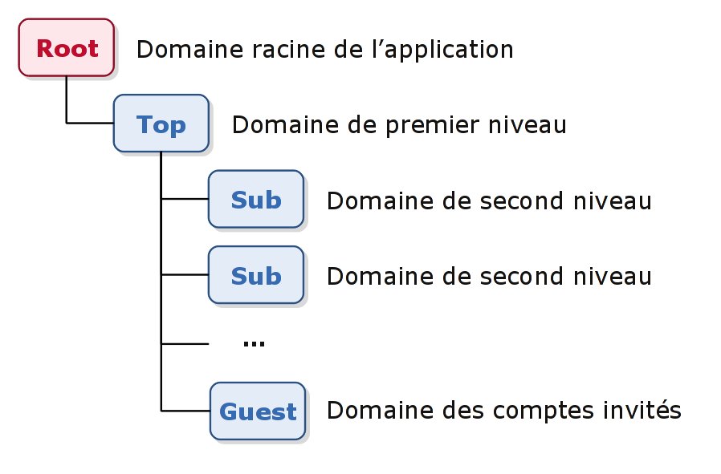

Le __domaine __Root____ est la racine de tous domaines. Il n’est pas visible dans la rubrique __Domaines__. Ce domaine __Root__ possède un ou plusieurs domaines sous son contrôle : les domaines __Top__.

De même un __domaine __Top____ possède un ou plusieurs sous-domaines appelés __domaines __Sub____ et un __domaine __Guest____ optionnel (pour les comptes invités).

La configuration des fonctionnalités est liée à un domaine. Si aucune modification de fonctionnalités n’a été faite sur un domaine __Sub__, alors LinShare se base sur le paramétrage du domaine supérieur, ainsi de suite.

Grâce à cette hiérarchie, il est possible de définir une configuration obligatoire pour certains sous-domaines tout en laissant quelques fonctionnalités personnalisables par sous-domaines.

De plus, chaque administrateur possèdent les droits d’administration sur le domaine auquel il est rattaché ainsi que sur tous les sous-domaines. Une population d’administrateurs peut donc être associée au domaine __Top__ tandis que les utilisateurs seront associés aux domaines __Sub__. Un administrateur peut être administrateur de plusieurs domaines __Top__ dans la mesure où il est rattaché à chacun de ces domaines __Top__.

Lors de création d’un utilisateur invité, les domaines de type __Sub__ recherchent le domaine invité au même niveau, alors que les domaines de type __Top__ le recherchent dans leurs sous-domaines.

L’__ajout d’un domaine__ dans LinShare est réalisé selon les étapes suivantes :

1.  Configuration de la connexion à un annuaire LDAP ;
2.  Création d’un modèle de domaines ;
3.  Création d’un domaine __Top__ ;
4.  Création de sous-domaines __Sub__ et d’un domaine «__Guest__»

## <a name="num02">Portail web LinShare</a>

#### Page d’accueil de LinShare Administration

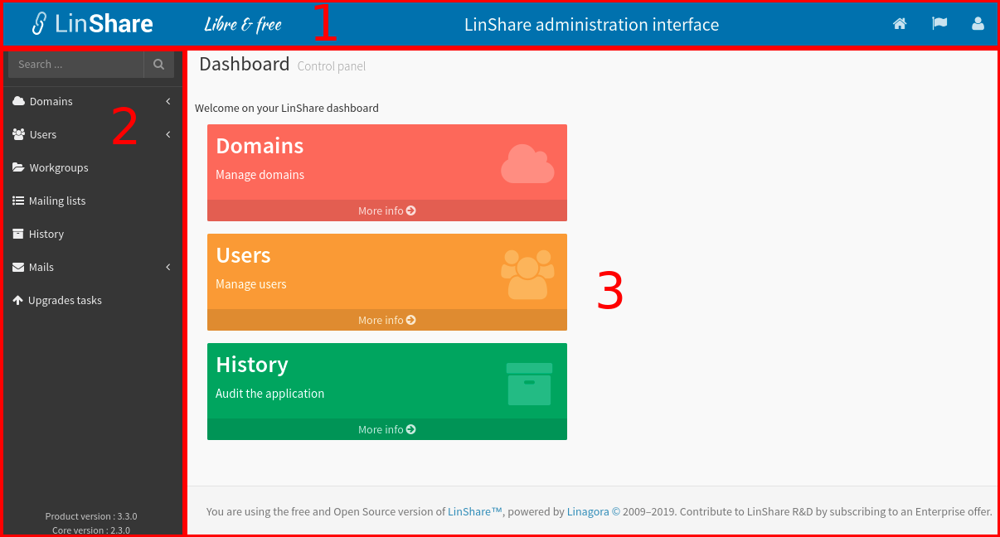

#### Agencement d’une page

Toutes les pages de rubrique dans LinShare sont découpées en __plusieurs panneaux__ :

1.  __Menu de navigation :__ pour accéder aux rubriques ;
2.  __Panneau __Paramétrage de l’accès__ :__ langue, mot de passe, déconnexion ;
3.  __Zone principale :__ information, formulaire, etc.

## <a name="num04">Général</a>

### <a name="num05">Connexion</a>

#### Synoptique

Pré-requis :

-   aucun.

Opérations :

1.  Depuis votre navigateur web, allez à l’adresse de l’application ;
>Note :<br/>
L’interface est en langue anglo-saxonne, car comme l’utilisateur n’a pas encore authentifié, il n’est pas possible de déterminer sa langue préférée.

2.  Saisissez vos identifiant et mot de passe, puis cliquez sur le bouton __Connexion__.

### <a name="num06">Changement du mot de passe</a>

#### Synoptique

Pré-requis :

-   avoir un compte utilisateur invité existant dans LinShare.

Opérations :

1.  Depuis l’en-tête de la page de connexion, cliquez sur le lien de son compte, et sélectionner __Modifier le mot de passe__ ;

2.  Saisissez votre ancien mot de passe, puis deux fois le nouveau.

### <a name="num07">Changer la langue de l’interface</a>

#### Synoptique

Pré-requis :

-   aucun.

Opérations :

1.  Depuis l’en-tête de n’importe quelle page, cliquez sur un le lien de sélection de langue.

## <a name="num1">Domaines</a>

### <a name="num11">Configuration des domaines</a>

#### Synoptique

Pré-requis :

-   connexion LDAP : si l’on souhaite lier une population au nouveau domaine ;
-   modèle de domaine : si l’on souhaite lier une population au nouveau domaine.

Opérations :

1.  Depuis le menu de navigation, allez à la rubrique __Domaines  Configuration des domaines__ ;

2.  Cliquer sur __+__ à droite du __RootDomain__, afin d'ajouter un __top domain__ 

3.  Saisissez des valeurs dans les champs du formulaire, puis cliquez sur le bouton __Sauvegarder__.

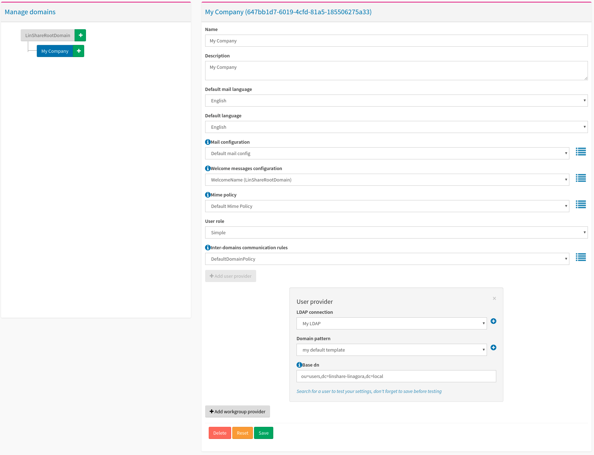

#### Description des champs : Domaine __Top__

Paramètres pour un domaine __Top__ :
-   __Nom :__ un identifiant unique pour le domaine ;
-   __Description :__ une description du domaine ;
-   __Langue des mails par défaut :__ Anglais, Français ou Russe ;
-   __Langue par défaut :__ Anglais, Français, Vietnamien ou Russe ;
-   __Configuration de courriel :__ ??? ;
-   __Configuration des messages d'accueil :__ ;
-   __Politique de type MIME :__ ;
-   __Rôle de l’utilisateur :__ le rôle des utilisateurs de ce domaine ;
-   __Règles de communication inter-domaines :__ ??? ;
-   __Connexion LDAP:__ profil de connexion LDAP à utiliser\* ;
-   __Modèle de domaine :__ le modèle de domaine à utiliser\* ;
-   __Base dn :__ chemin vers l'Organizational Unit qui contient les utilisateurs\* ;

\*Champ optionnel lorsque l’on ne souhaite pas lier une population d’utilisateurs au domaine.

#### Description des champs : Sous-domaines __Sub__ et __Guest__

On peut créer un sous-domaine __Sub__ de la même manière qu’un domaine __Top__.

En revanche, un domaine __Guest__ aura moins de paramètres.

Paramètres pour un sous-domaine __Guest__ :
-   __Nom__ ;
-   __Description__ ;
-   __Langue des mails par défaut__ ;
-   __Langue par défaut__ ;
-   __Configuration de courriel__ ;
-   __Configuration des messages d'accueil__ ;
-   __Politique de type MIME__ ;
-   __Règles de communication inter-domaines__.

### <a name="num12">Règles de communication inter-domaines</a>

#### Synoptique

Pré-requis :

-   au moins un domaine doit exister.

Opérations :

1.  Depuis le menu de navigation, allez à la rubrique __Domaines  Règles de communication inter-domaines__ : la liste des politiques de domaines s'affiche ;

2.  Cliquer sur l'un des politiques : ses règles s'affichent.

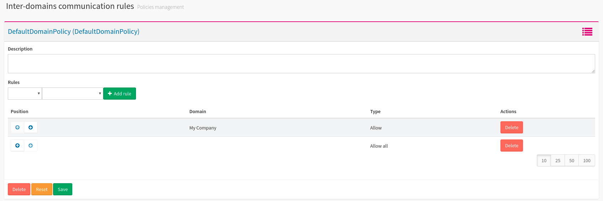

3.  Il est alors possible d'ajouter éventuellement des règles pour chaque domaine : __Autorisé__, __Tout autorisé__, __Interdit__, __Tout interdit__.

### <a name="num13">Fonctionnalités</a>

#### Synoptique

Pré-requis :

-   Aucun.

Opérations :

1.  Depuis le menu de navigation, allez à la rubrique __Domaines  Fonctionnalités__ : la liste des fonctionnalités et de leurs statuts s'affiche ;

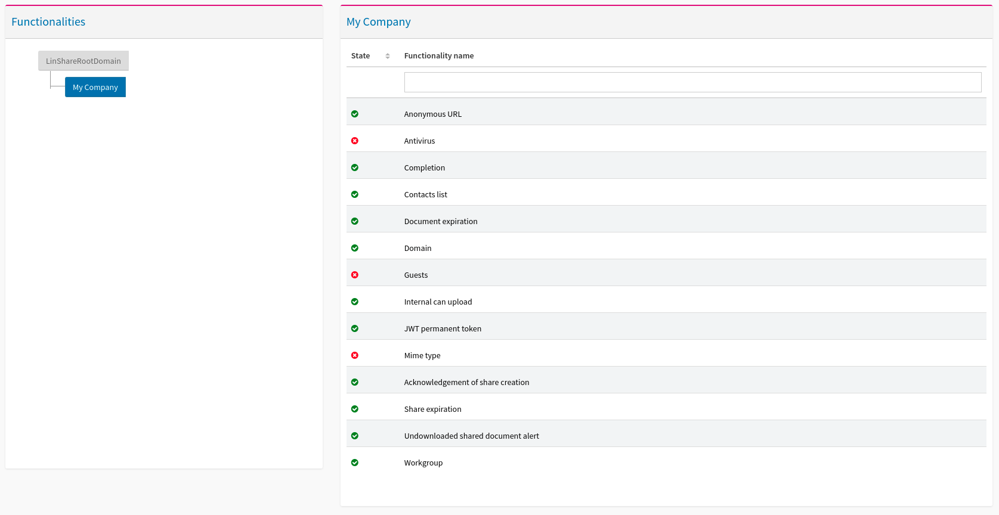

2.  Cliquer sur l'une des fonctionnalités : il est alors possible d'activer ou de désactiver la fonctionnalité.

3.  Il est possible de cliquer sur __Avancé__ pour configurer les détails de la fonctionnalité. Les détails varient d'une fonctionnalité à une autre :


### <a name="num14">Connexion LDAP</a>

#### Synoptique

Pré-requis :

-   pré-requis à l’utilisation : accès à un annuaire de type LDAP.

Opérations :

1.  Depuis le menu de navigation, allez à la rubrique __Domaines  Connexion LDAP__ : la liste des connexions LDAP disponibles s'affiche ;

2.  Cliquer sur l'une des connexions LDAP disponible ou créer une nouvelle connexion LDAP : ses paramètres s'affichent.


#### Description des champs : Connexion LDAP

Les paramètres d’une connexion LDAP sont les suivants :

-   __URL du fournisseur :__ adresse URI selon la syntaxe suivante : `{ldap|ldaps}://{ip|hostname}:port`
-   __LDAP 'user dn' :__ DN du compte d’accès\* à l’annuaire LDAP

>Note :<br/>
Le DN est différent d'un utilisateur standard du LDAP. En effet, il s'agit ici du Manager, qui n'est pas dans une __Organizational Unit__ comme tout autre compte LDAP standard.

-   __LDAP 'password' :__ mot de passe\* du compte d’accès à l’annuaire

\*Champs optionnels dans le cas d’une connexion anonyme.

>Attention :<br/>
L’indisponibilité d’un annuaire paralyse fortement le fonctionnement de l’application. En effet, le cœur de LinShare s’appuie sur les annuaires, beaucoup d’opérations seront donc impossibles.

### <a name="num15">Modèle de domaines</a>

#### Synoptique

Pré-requis :

-   aucun.

Opérations :

1.  Depuis le menu de navigation, allez à la rubrique __Domaines  Modèle de domaines__ : la liste des modèles de domaine s'affiche ;

2.  Cliquer sur l'un des modèles de domaine ou créer un nouveau modèle de domaine : ses paramètres s'affichent.

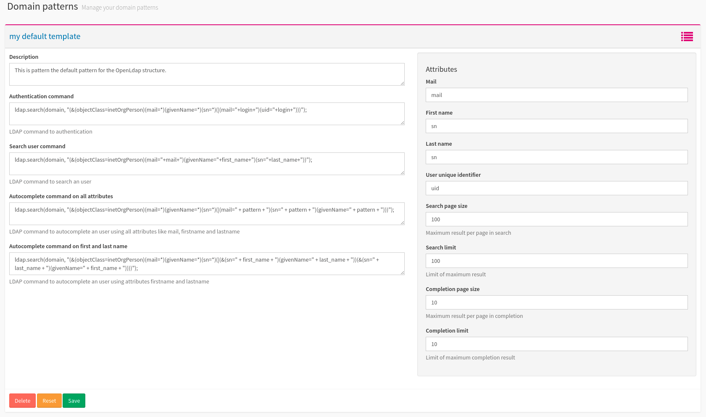

#### Description des champs : Modèle de domaines

Un modèle de domaines permet de définir comment récupérer les informations liées aux utilisateurs (nom, prénom, adresse électronique) et où les trouver (groupes, branches, attributs).

Les différentes commandes définies dans un modèle de domaines sont des requêtes LDAP en JavaScript (LQL : Ldap Query Language). Ces requêtes permettent une grande souplesse d'intégration avec un annuaire. Une requête retourne une liste de DN *(Distinguished Name)*.

Voir [LQL-function.md)(LQL-function.md) pour plus de détails.

Les paramètres d’un modèle de domaines sont les suivants :

-   __Name :__ description distinct du modèle ;

-   __Description :__ description succincte du modèle ;

-   __Commande d'authentification :__ cette commande est utilisée pour l’authentification à LinShare. Elle doit retourner une liste contenant un seul élément ;
>Exemple :<br/>
```
ldap.search(domain, "(&(objectClass=inetOrgPerson)(mail=*)(givenName=*)(sn=*)(|(mail="+login+")(uid="+login+")))");
```

-   __Commande utilisateur :__ cette commande est utilisée pour rechercher un utilisateur de LinShare ;
>Exemple :<br/>
```
ldap.search(domain, "(&(objectClass=inetOrgPerson)(mail="+mail+")(givenName="+first_name+")(sn="+last_name+"))");
```

-   __Commande d'autocompletion sur tous les attributs:__ cette commande est utilisée pour autocompléter un utilisateur sur tous les attributs comme le courriel, le prénom et le nom ;
>Exemple :<br/>
```
ldap.search(domain, "(&(objectClass=inetOrgPerson)(mail=*)(givenName=*)(sn=*)(|(mail=" + pattern + ")(sn=" + pattern + ")(givenName=" + pattern + ")))");
```

-   __Commande d'autocompletion sur le prénom et le nom:__ cette commande est utilisée pour autocompléter un utilisateur sur les attributs prénom et nom ;
>Exemple :<br/>
```
ldap.search(domain, "(&(objectClass=inetOrgPerson)(mail=*)(givenName=*)(sn=*)(|(&(sn=" + first_name + ")(givenName=" + last_name + "))(&(sn=" + last_name + ")(givenName=" + first_name + "))))");
```


-   __Attribut email :__ ce champ contient le nom de l’attribut LDAP contenant une adresse électronique dans l’annuaire ;
>Exemple :<br/>
`mail`

-   __Attribut prénom :__ ce champ contient le nom de l’attribut LDAP contenant un prénom dans l’annuaire ;
>Exemple :<br/>
`givenName`

-   __Attribut nom de famille :__ ce champ contient le nom de l’attribut contenant un nom de famille dans l’annuaire ;
>Exemple :<br/>
`sn`

-   __Attribut Identifiant unique utilisateur :__ permet de renseigner une clé unique d’identification immuable de l’utilisateur, tel qu’un __*uid__* ou __*sAMAccountName__*. À défaut on peut également utiliser l’adresse de courriel de la personne ;
>Exemple :<br/>
`uid`

-   __Taille de page de recherche :__ permet de configurer la manière dont LinShare récupère les résultats de l’annuaire. Il indique un nombre maximum de résultats par page lors d’une recherche ;

    Par défaut, ce paramètre est fixé à 100 résultats.

    La valeur zéro désactive la pagination.

-   __Limite de recherche :__ permet de configurer le nombre maximum de résultats retournés par l’annuaire lors d’une recherche.

    Par défaut, ce paramètre est fixé à 100 résultats. Généralement, l’utilisateur n’a pas besoin de lister l’intégralité de l’annuaire, surtout si celui-ci contient des centaines de milliers d'utilisateurs.

    La valeur zéro désactive la limite de résultats.

-   __Taille de page de complétion :__ permet de configurer la manière dont LinShare récupère les résultats de l’annuaire. Il indique un nombre maximum de résultats par page lors d’une auto complétion.

    Par défaut, ce paramètre est fixé à 10 résultats.

    La valeur zéro désactive la pagination.

-   __Completion limit :__ permet de configurer le nombre maximum de résultats retournés par l’annuaire lors d’une auto complétion.

    Par défaut, ce paramètre est fixé à 10 résultats. En effet, il est inutile de retourner tous résultats possibles, potentiellement des centaines voire des milliers d’utilisateurs.

    La valeur zéro désactive la limite de résultats.

### <a name="num16">Modèles de groupe de travail</a>

#### Synoptique

Pré-requis :

-   aucun.

Opérations :

1.  Depuis le menu de navigation, allez à la rubrique __Domaines  Modèles de groupe de travail__ : la liste des modèles de groupe de travail s'affiche ;

2.  Cliquer sur l'un des modèles de groupe de travail ou créer un nouveau modèle de groupe de travail : ses paramètres s'affichent.

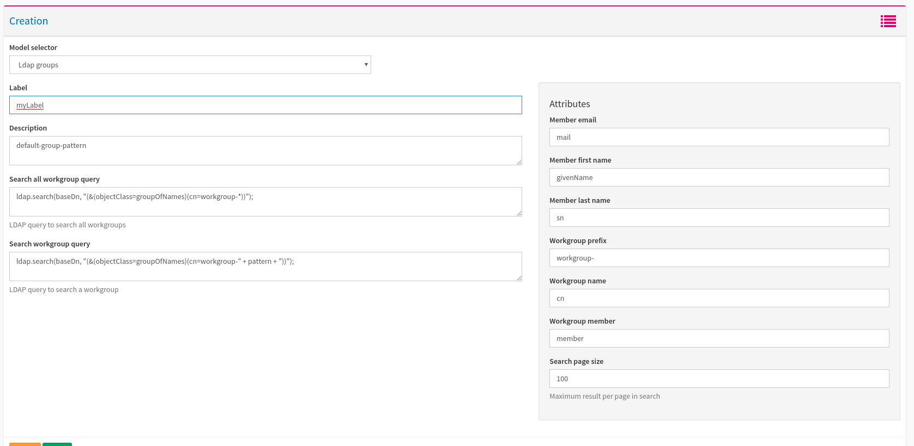

#### Description des champs : Modèles de groupe de travail

Un modèle de groupe de travail permet de définir comment récupérer les informations liées aux membres de celui-ci (nom, prénom, adresse électronique des membres) et où les trouver.

Les différentes commandes définies dans un modèle de groupe de travail sont des requêtes LDAP en JavaScript (LQL : Ldap Query Language). Ces requêtes permettent une grande souplesse d'intégration avec un annuaire. Une requête retourne une liste de DN *(Distinguished Name)*.

Voir [LQL-function.md)(LQL-function.md) pour plus de détails.

Les paramètres d’un modèle de groupe de travail sont les suivants :

-   __Label :__ description distinct du modèle ;

-   __Description :__ description succincte du modèle ;

-   __Commande de Recherche de tous les groupes de travail :__ cette commande est utilisée pour rechercher tous les groupes de travail ;
>Exemple :<br/>
```
ldap.search(baseDn, "(&(objectClass=groupOfNames)(cn=workgroup-*))");
```

-   __Commande de Recherche d'un groupe de travail :__ cette commande est utilisée  pour rechercher un groupe de travail ;
>Exemple :<br/>
```
ldap.search(baseDn, "(&(objectClass=groupOfNames)(cn=workgroup-" + pattern + "))");
```


-   __Attribut email du membre :__ ce champ contient le nom de l’attribut LDAP contenant une adresse électronique dans l’annuaire ;
>Exemple :<br/>
`mail`

-   __Attribut prénom du membre :__ ce champ contient le nom de l’attribut LDAP contenant un prénom dans l’annuaire ;
>Exemple :<br/>
`givenName`

-   __Attribut nom de famille du membre :__ ce champ contient le nom de l’attribut contenant un nom de famille dans l’annuaire ;
>Exemple :<br/>
`sn`

-   __Attribut préfix du groupe de travail :__ l'objet LDAP standard __groupOfNames__ est défini avec un préfix dans son nom, afin de le différencier des autres objects de ce type qui pourraient être utilisés par une autre application dans l'organisation. Son préfix est fixé à `workgroup-` La valeur de ce champ permet ici de masquer ce préfix dans l'application, pas de définir le préfix qui va être utilisé.
>Exemple :<br/>
`workgroup-`

-   __Attribut nom du groupe de travail :__ permet de renseigner un nom distinctif pour le groupe de travail.
>Exemple :<br/>
`cn`

-   __Attribut membre du groupe de travail :__ permet de spécifier l'attribut LDAP de l'objet LDAP __groupOfNames__ qui est utilisé ici.
>Exemple :<br/>
`member`

-   __Taille de page de recherche :__ permet de configurer la manière dont LinShare récupère les résultats de l’annuaire. Il indique un nombre maximum de résultats par page lors d’une recherche ;

    Par défaut, ce paramètre est fixé à 100 résultats.

    La valeur zéro désactive la pagination.

### <a name="num17">Règles de typeMIME</a>

#### Synoptique

Pré-requis :

-   aucun.

Opérations :

1.  Depuis le menu de navigation, allez à la rubrique __Domaines  Règles de type MIME__ : la liste des politiques s'affiche ;

2.  Cliquer sur l'une des politiques : les détails s'affichent pour chaque extension de fichier : il est alors possible d'autoriser ou de bloquer les fichiers par extension.

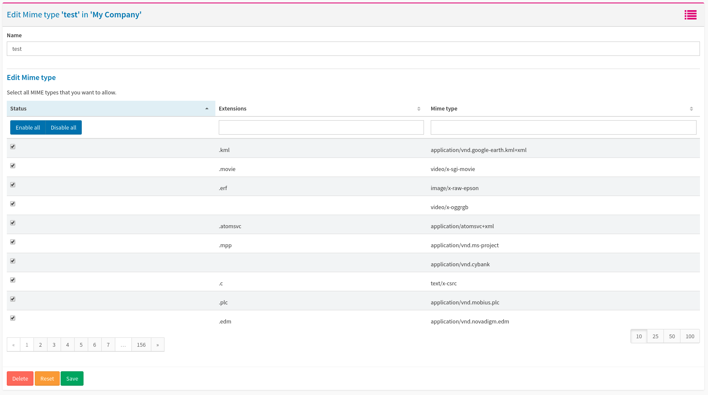

### <a name="num18">Messages d'accueil</a>

#### Synoptique

Pré-requis :

-   aucun.

Opérations :

>Note :<br/>
Il s'agit ici du message qui s'affiche sur la page d'accueil de l'interface utilisateur.

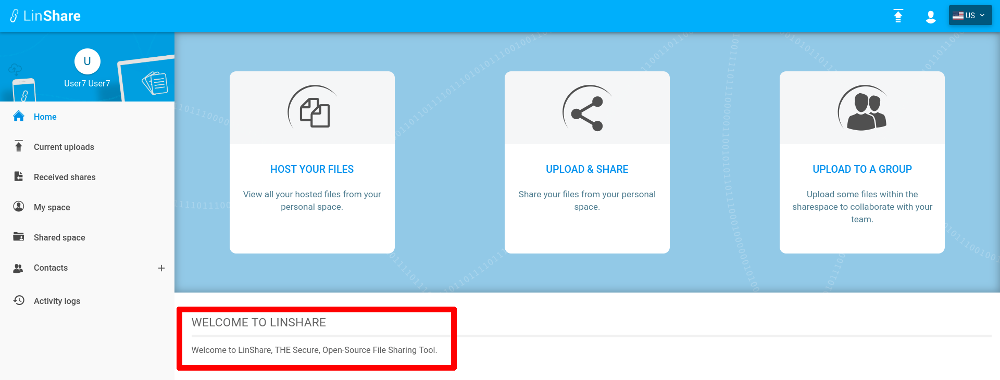

1.  Depuis le menu de navigation, allez à la rubrique __Domaines  Messages d'accueil__ : la liste des messages s'affiche ;

2.  Cliquer sur l'un des messages : il est possible de modifier le message dans les langes suivantes : __Anglais, Français, Russe__ et __Vietnamien__. De plus il est possible d'assigner les domaines à ce message.

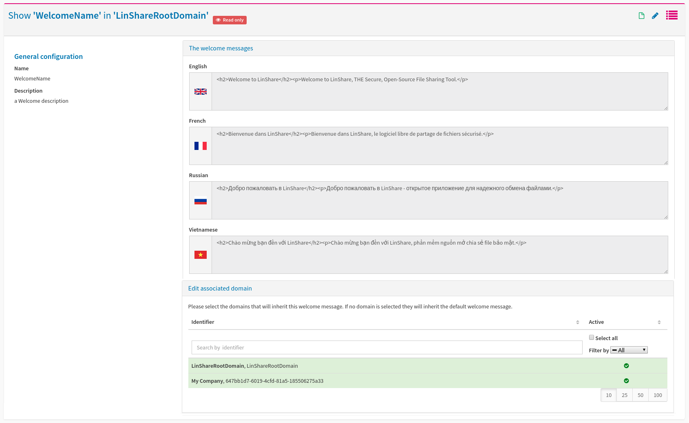

### <a name="num19">Configuration du quota des domaines</a>

#### Synoptique

Pré-requis :

-   aucun.

Opérations :

1.  Depuis le menu de navigation, allez à la rubrique __Domaines  Configuration du quota des domaines__, puis sélectionner le domaine à configurer ;

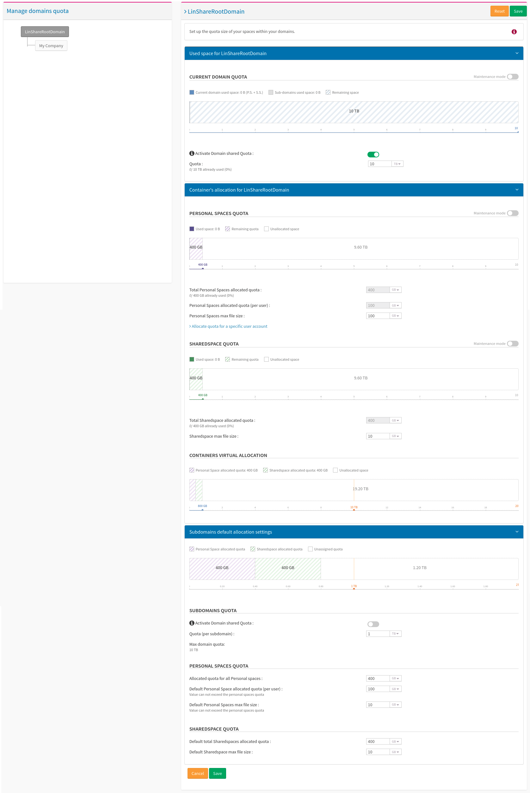

Il y a 3 sections différentes :

>Note :<br />
Pour chaque section, le mode maintenance permet de bloquer tous les nouveaux transferts de fichier, sans interrompre les transferts en cours.

-     __Espace utilisé__ pour le domaine courant : dans cette section on trouve :
      -       un graphique montrant l'allocation des quotas du domaine courant
      -       la possibilité de définir une limite de quota total du domaine.

>Note :<br />
Si aucune limite n'est définie, la limite est héritée du domaine parent.

-     __Quota des espaces__ pour le domaine courant : dans cette section on trouve :
      -       un quota pour les espaces personnels : quota des espaces personnels et quota par utilisateur
      -       un quota pour les espaces communs.

-     __Paramétrages des quotas des sous-domaines__ : idem __Quota des espaces__, sauf que ces réglages vont être hérités aux domaines enfants du domaine courant.

### <a name="num2">Utilisateurs</a>

### <a name="num21">Configuration des utilisateurs</a>

#### Synoptique

Pré-requis :

-   aucun.

Opérations :

1.  Depuis le menu de navigation, allez à la rubrique __Utilisateurs  Configuration des utilisateurs__ ;

2.  Saisir un mot clé à rechercher dans un champ de recherche, puis presser la touche Entrée ; Cliquer sur le nom, pour éditer ses paramètres.


>Note :<br/>
Une __recherche simple__ porte simultanément sur les trois champs suivants : le nom, le prénom et l’adresse électronique. Pour des critères plus précis, faites une recherche avancée.

3.  Adapter les champs, puis cliquer sur le bouton __Sauvegarder__.

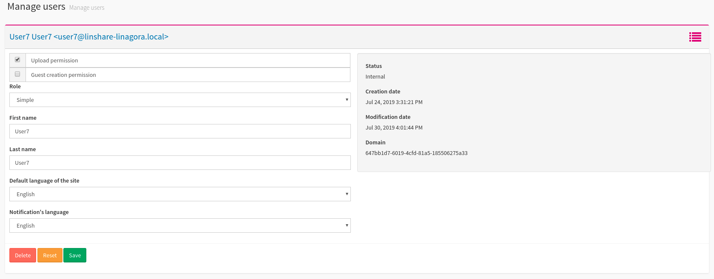

4.  Configurer le quota de l'espace personnel de l'utilisateur, puis cliquer sur le bouton __Sauvegarder__.


### <a name="num22">Utilisateurs incohérents</a>

#### Synoptique

Pré-requis :

-   aucun.

Opérations :

>Note :<br />
Toute modification ou suppression d'un utilisateur sur l'annuaire LDAP entraîne sa catégorisation en utilisateur incohérent. C'est ensuite le rôle de l'administrateur de vérifier son statut manuellement via l'interface. L'objectif de cette fonctionnalité est d'éviter la suppression involontaire de tous les fichiers d'un colaborateur qui a quitté une entreprise par exemple.

1.  Depuis le menu de navigation, allez à la rubrique __Utilisateurs  Utilisateurs incohérents__.

2.  Saisir un mot clé à rechercher dans un champ de recherche, puis presser la touche Entrée: il est alors possible de visualiser la cohérence de l'utilisateur.


### <a name="num23">Comptes techniques</a>

#### Synoptique

Pré-requis :

-   au moins un compte technique doit exister (c’est le cas par défaut : à l’installation de l’application, le compte technique pour le module __Demande de dépôt__ existe).

Opérations :

1.  Depuis le menu de navigation, allez à la rubrique __Utilisateurs  Comptes techniques__ : la liste des comptes techniques s'affiche.


2.  Ajouter un compte technique ou cliquer sur un compte technique déjà existant : un formulaire s'affiche avec les informations du compte, son statut (activé ou désactivé) et les permissions.

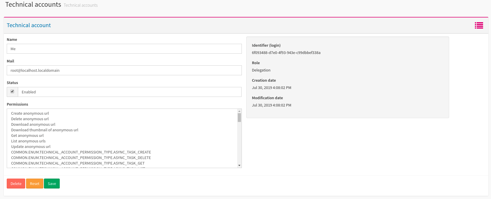

## <a name="num3">Groupes de Travail</a>

Pré-requis :

-   au moins un groupe de travail avec au moins un membre doit être défini depuis l'interface utilisateur par un utilisateur LinShare.

Opérations :

1.  Depuis le menu de navigation, allez à la rubrique __GROUPES DE TRAVAIL__ ;

2.  Saisissez des critères de recherche, puis cliquez sur le bouton __Rechercher__ : les résultats s'affichent.

3.  Cliquez sur un groupe de travail : les détails s'affichent avec la liste de ses membres.

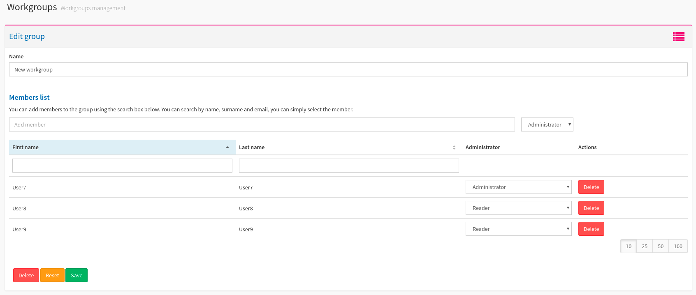

## <a name="num4">Listes de Diffusion</a>

Pré-requis :

-   au moins une liste de contacts a été défini dans l'interface utilisateur par un utilisateur LinShare.

Opérations :

1.  Depuis le menu de navigation, allez à la rubrique __LISTE DE DIFFUSION__ : les différentes listes s'affichent.

2.  Cliquez sur une liste de diffusion: la liste de ses membres s'affichent.

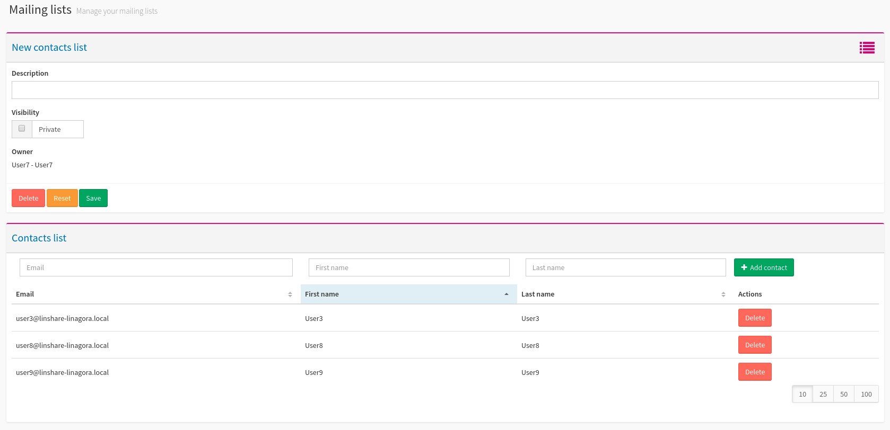

>Note:<br />
Bien qu'il ne soit pas possible pour l'administrateur de créer une liste de diffusion, il est cependant tout à fait possible de modifier les listes existantes : ajouter, supprimer des membres, changer la visibilité de la liste, changer la description.

## <a name="num5">Historique (Audit)</a>

#### Synoptique

Pré-requis :

-   aucun.

Opérations :

1.  Depuis le menu de navigation, allez à la rubrique __HISTORIQUE__ ;

2.  Saisissez des critères de recherche, puis cliquez sur le bouton __Rechercher__.

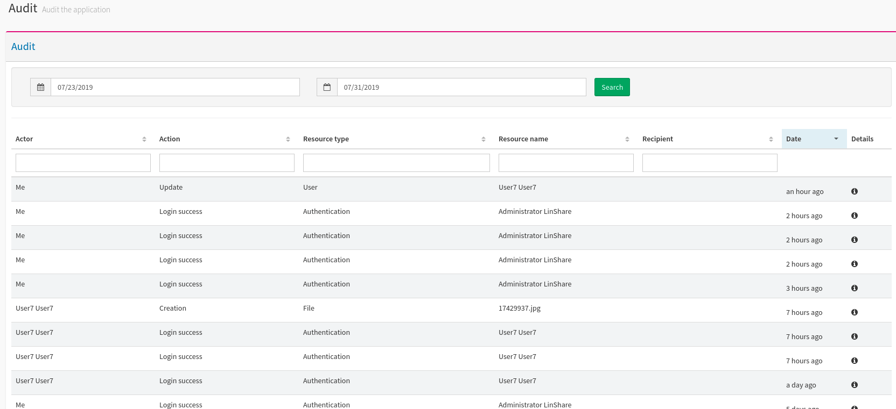

## <a name="num6">Courriels</a>

### <a name="num61">Configuration de courriel</a>

#### Synoptique

Pré-requis :

-   sélection du domaine sur lequel portera l’action, via le panneau __Sélection du domaine__.

Opérations :

1.  Depuis le menu de navigation, allez à la rubrique __Courriels  Configuration de courriel__ ;

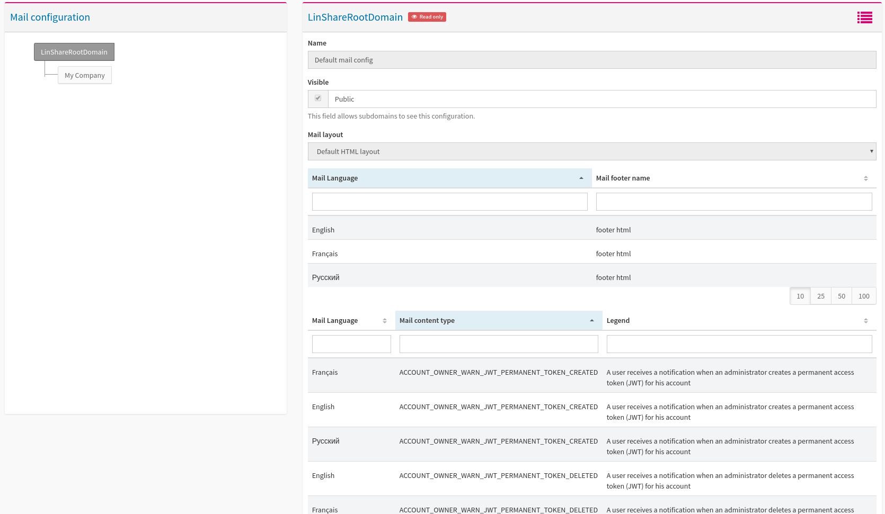

2.  Sélectionner le domaine parent et cliquer sur __+__ pour créer une configuration de courriel, ou bien sélectionner une configuration de courriel déjà existante à modifier

3.  Dans chacune des trois zones de paramétrage, modifiez le texte souhaité.

### <a name="num62">Structure de courriel</a>

#### Synoptique

Pré-requis :

-   sélection du domaine sur lequel portera l’action, via le panneau __Sélection du domaine__.

Opérations :

1.  Depuis le menu de navigation, allez à la rubrique __Courriels  Structure de courriel__ ;

2.  Sélectionner le domaine parent et cliquer sur __+__ pour créer une structure de courriel, ou bien sélectionner une structure de courriel déjà existante à modifier

3.  Dans chacune des trois zones de paramétrage, modifiez le texte souhaité.

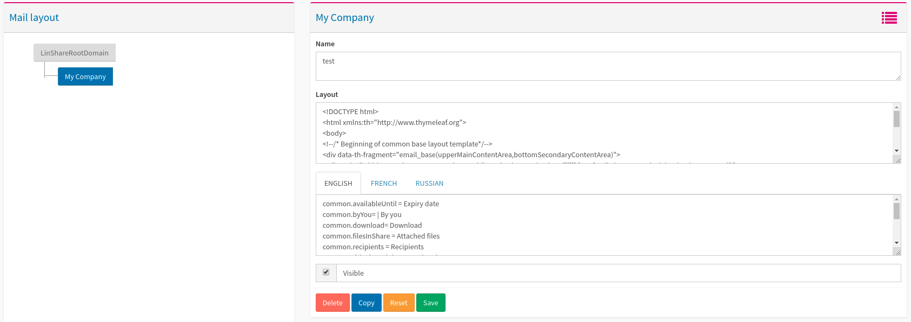

>Note :<br />
Il existe une structure pour chaque langue d'affichage disponible sur LinShare : Anglais, Français et Russe.

### <a name="num63">Pied de courriel</a>

#### Synoptique

Pré-requis :

-   sélection du domaine sur lequel portera l’action, via le panneau __Sélection du domaine__.

Opérations :

1.  Depuis le menu de navigation, allez à la rubrique __Courriels  Pied de courriel__ ;

2.  Sélectionner le domaine parent et cliquer sur __+__ pour créer un pied de courriel, ou bien sélectionner un pied de courriel déjà existant à modifier

3.  Dans chacune des trois zones de paramétrage, modifiez le texte souhaité.


>Note :<br />
Il existe une structure pour chaque langue d'affichage disponible sur LinShare : Anglais, Français et Russe.

### <a name="num64">Contenu de courriel</a>

#### Synoptique

Pré-requis :

-   sélection du domaine sur lequel portera l’action, via le panneau __Sélection du domaine__.

Opérations :

1.  Depuis le menu de navigation, allez à la rubrique __Courriels  Contenu de courriel__ ;

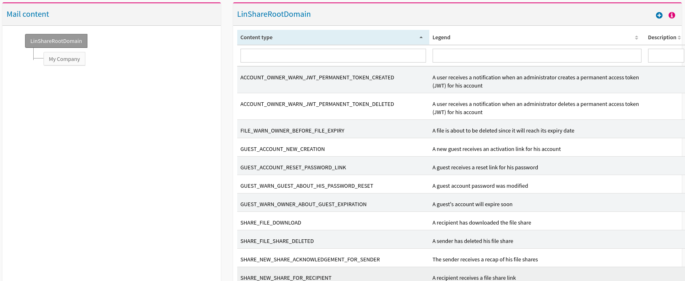

2.  Sélectionner le domaine parent et cliquer sur __+__ pour créer un contenu de courriel, ou bien sélectionner un contenu de courriel déjà existant à modifier

3.  Dans chacune des trois zones de paramétrage, modifier le texte souhaité.

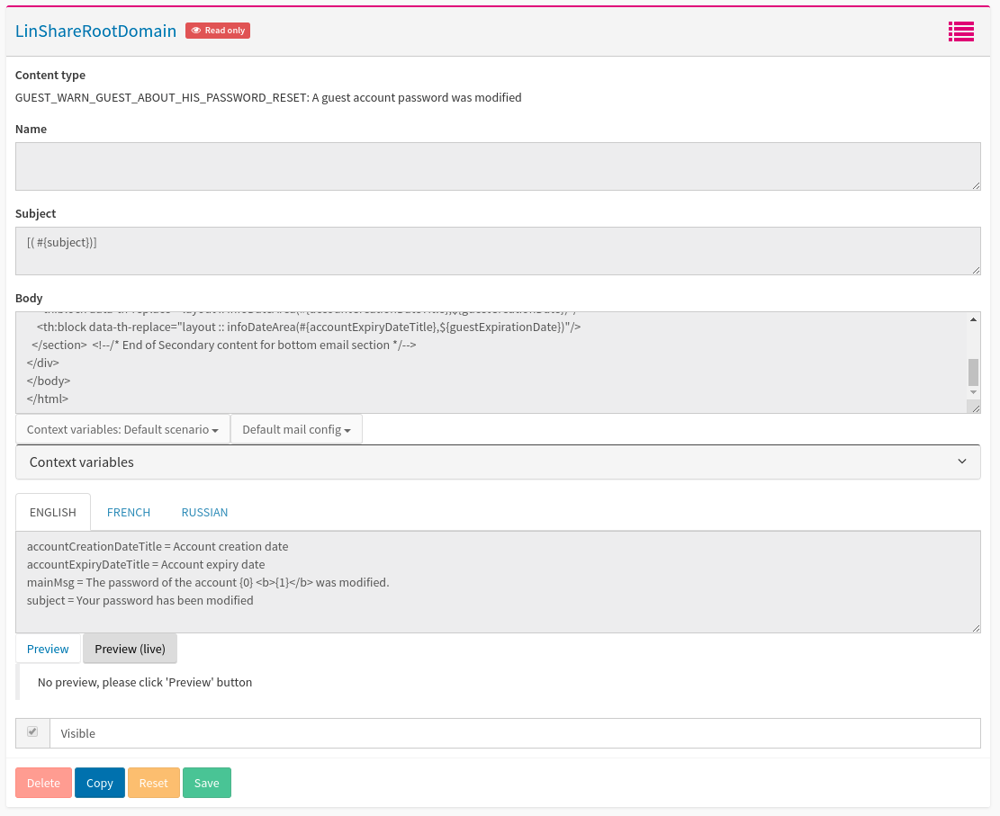

### <a name="num65">Activation des notifications</a>

#### Synoptique

Pré-requis :

-   aucun.

Opérations :

1.  Depuis le menu de navigation, allez à la rubrique __Courriels  Activation des notifications__ : la liste des éléments s'affiche.

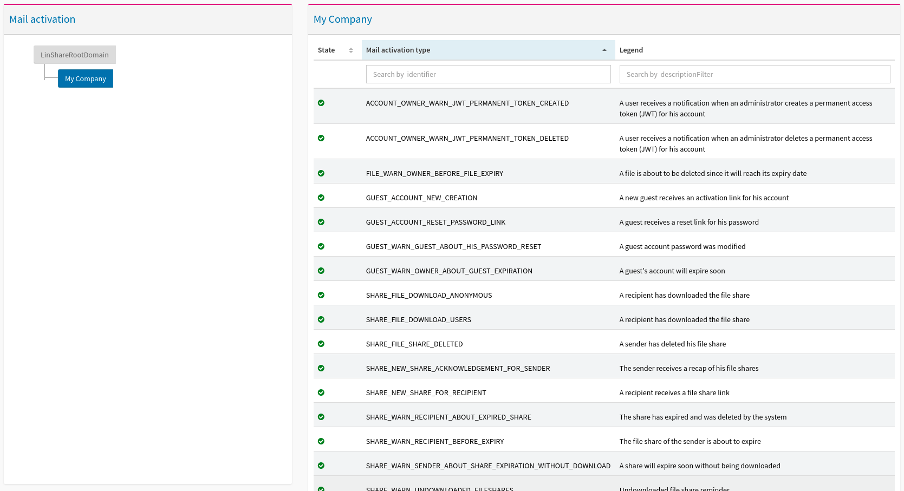

2.  Cliquer sur un élément : il est alors possible d'activer ou de désactiver la notification.

3.  Il est possible de cliquer sur __Avancé__ pour configurer les détails de la notification :

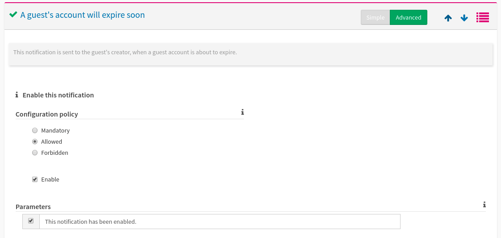